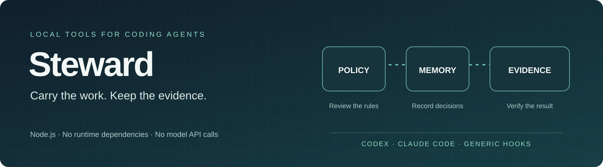

# Steward



**코딩 에이전트를 위한 로컬 정책, 지속 가능한 기억, 확인 가능한 검증 도구.**

Node.js 22+ · MIT · 런타임 의존성 없음 · English / 한국어

[English](README.md) · [한국어](README.ko.md) · [CI](https://github.com/AquilaXk/steward/actions/workflows/ci.yml) · [Discussions](https://github.com/AquilaXk/steward/discussions)

코딩 에이전트가 긴 작업을 수행할 때 작업 지침, 기억한 결정, 완료 근거는 서로 다른
곳에 남기 쉽습니다. Steward는 작은 로컬 명령과 스킬 8개로 이 정보를 연결합니다.
격리된 데모부터 실행하고 파일을 살펴본 다음, 프로젝트에 필요한 절차만 적용하세요.

> **검증 결과의 의미.** Steward는 정책 판단, 저장한 메모, 검토된 로컬 명령의 결과를
> 기록합니다. 완료 게이트는 검사 결과를 소스, 실행 권한, 계획, 런타임에 연결합니다.
> 모델 인증, 작성자 신원 확인, 배포 상태 증명이나 호스트 샌드박스의 대체는 아닙니다.

## 설치

Node.js 22 이상과 로컬 파일·명령 실행이 가능한 호스트가 필요합니다.

**Claude Code**

```text
/plugin marketplace add AquilaXk/steward
/plugin install steward@steward
```

새 세션에서 `/steward:steward-policy 현재 프로젝트에 설정해줘`를 실행하세요.

**Codex CLI**

```sh
codex plugin marketplace add AquilaXk/steward
codex plugin add steward@steward
```

새 세션에서 설치된 Steward 플러그인의 `steward-policy` 스킬을 선택하고
현재 프로젝트에 설정해 달라고 요청하세요.

에이전트가 프로젝트 검사를 구성하고, 정책과 실행 명령을 보여주고 승인받은 뒤
프로젝트 훅을 설치합니다. 플러그인은 스킬 8개를 제공하며, 프로젝트 설정 시
`--plugin`으로 중복 복사를 방지합니다. 호스트 자체의 훅 신뢰·권한 설정도 적용됩니다.
저장소를 직접 복제해 사용한다면 [수동 설정](#4-프로젝트-설정)을 따르세요.

## 목차

1. [Steward가 필요한 이유](#1-steward가-필요한-이유)
2. [작업 흐름 한눈에 보기](#2-작업-흐름-한눈에-보기)
3. [격리된 데모 실행](#3-격리된-데모-실행)
4. [프로젝트 설정](#4-프로젝트-설정)
5. [스킬 선택](#5-스킬-선택)
6. [검증 근거 이해하기](#6-검증-근거-이해하기)
7. [저장소 구성](#7-저장소-구성)
8. [기여와 프로젝트 참여](#8-기여와-프로젝트-참여)
9. [참고 자료와 출처](#9-참고-자료와-출처)

## 1. Steward가 필요한 이유

“완료”라는 메모만으로는 어떤 명령이 통과했는지, 이후 소스가 바뀌었는지 알 수 없습니다.
저장한 결정도 당시의 확인 근거와 분리되면 권한이 불명확해집니다.
긴 지침 파일은 작은 작업을 필요 이상으로 복잡하게 만들기도 합니다.

Steward는 세 가지 책임을 분명하게 나눕니다.

| 책임 | 로컬 구현 | 확인할 수 있는 정보 |
|---|---|---|
| 정책 | 검증된 규칙과 정확한 번들 승인 | 일치한 규칙 ID, 거부, 생략된 지침 |
| 기억 | 타입이 있는 해시 연결 저널 | 결정, 질문, 목표, 인계와 세션 체크포인트 |
| 검증 | 검토된 명령 배열과 완료 게이트 | 검사 상태, 출력 해시, 소스 식별과 최신성 |

기본 정책은 작업 지침을 제공합니다. 모든 위험 명령을 막는 블랙리스트는 아닙니다.
초기 검증 계획은 실제 검사를 설정하기 전까지 의도적으로 실패합니다.

## 2. 작업 흐름 한눈에 보기

```text
정책·검사 검토 ──► 정확한 번들 승인 ──► 호스트 훅 설치
                          │
                   승인된 작업 수행
                          │
                   중요한 결정 기록
                          │
              검사 실행 ──► 근거 확인 ──► 완료 게이트
```

거부 규칙은 컨텍스트 예산보다 먼저 적용됩니다. 필수 지침이 예산에 들어가지 않으면
이벤트를 차단합니다. 선택 지침이 들어가지 않으면 생략한 이유를 보고합니다.

기억은 명시적으로 기록합니다. 필요한 시점에 결정이나 체크포인트를 저장하세요.
컨텍스트 압축은 이미 기록한 상태만 보존하며, 기록하지 않은 대화를 복구하지 않습니다.
이름이 있는 세션은 같은 세션 해시의 체크포인트만 복원합니다.

## 3. 격리된 데모 실행

저장소를 복제하고 Node.js 22 이상을 사용하세요. 기여자는 포함된 `.nvmrc`로
Node 22를 선택할 수 있습니다. npm 패키지 설치나 모델 API 키는 필요하지 않습니다.

```sh
git clone https://github.com/AquilaXk/steward.git
cd steward
node --version
npm run check
npm run demo
node bin/steward.mjs --help
```

데모는 임시 프로젝트에서 합성 산술 테스트 3개를 실행하고 체크포인트를 저장·복원합니다.
소스 변경 후에는 기존 검증 근거를 거부합니다. 실행 후 임시 파일을 정리하며,
실제 에이전트 앱은 실행하지 않습니다.

전체 로컬 소프트웨어 테스트는 `npm test`로 실행합니다.
실행 결과와 검증 범위는 [검증 기록](evidence/VERIFICATION.md)을 확인하세요.

## 4. 프로젝트 설정

도구 디렉터리를 안정적인 경로에 보관하세요. 해당 디렉터리에서
`/absolute/path/to/project`를 초기화할 프로젝트 경로로 바꾸어 실행합니다.
마켓플레이스로 설치했다면 에이전트가 실제 플러그인 경로를 사용하고,
아래 `init`과 `install` 명령에 모두 `--plugin`을 붙입니다.

```sh
node bin/steward.mjs init --project /absolute/path/to/project
node bin/steward.mjs trust --project /absolute/path/to/project
```

`.steward/policy.json`을 살펴보고 `.steward/verify.json`의 실패 예제를
실제 프로젝트 검사로 교체하세요. `trust`를 다시 실행해 변경된 규칙, 명령과 해시를
검토한 다음, 확인한 정확한 해시를 승인합니다.

```sh
node bin/steward.mjs trust --project /absolute/path/to/project --approve REVIEWED_HASH
node bin/steward.mjs install --project /absolute/path/to/project --host codex
node bin/steward.mjs doctor --project /absolute/path/to/project --host codex
```

Claude Code는 설치 명령에서 `--host claude`를 사용합니다.
훅에 의존하기 전에 호스트 자체의 신뢰·권한 검토도 완료하세요.

| 호스트 | 스킬 | 훅 설정 |
|---|---|---|
| Codex | `.agents/skills/steward-*` | `.codex/hooks.json` |
| Claude Code | `.claude/skills/steward-*` | `.claude/settings.local.json` |
| 일반 호출자 | 선택적 절차 | `hook --host generic`의 JSON 입력 |

Claude 설치는 `CLAUDE.md`에서 공통 `AGENTS.md`를 가져오도록 연결합니다.
생성된 `.steward/USAGE.md`에는 실제 실행 파일과 예제 경로가 기록됩니다.
표의 스킬 경로는 수동 설치 기준이며, 플러그인 설치는 번들 스킬을 사용합니다.
도구나 플러그인 업데이트 후에는 현재 경로에서 `update --host codex` 또는
`update --host claude`를 실행하세요. 플러그인을 제거하기 전에
`uninstall --host <host>`를 실행하면 프로젝트 데이터는 보존하면서
등록된 훅과 수정하지 않은 관리 대상 스킬을 제거합니다.

**사용자가 수정한 파일은 보존합니다.** 관리 대상 스킬이 수정되었으면 업데이트가
중단되고, 소유권이 없는 기존 파일은 `skipped`로 남습니다.
이전 이름으로 설치한 상태도 자동 이전하지 않습니다.
훅을 적용하기 전에 [운영 안내](docs/OPERATIONS.md)와
[호스트 확인 절차](docs/HOSTS.md#required-native-smoke-test)를 읽어보세요.

`version`으로 설치 버전을 확인하세요. 패키지·CLI·플러그인은 `0.2.0`을 공유하며,
[변경 기록](CHANGELOG.md)에 버전 정책과 변경 내용을 정리했습니다.
필요한 기억은 `journal query --text <검색어> --limit 20`으로 조회합니다.
만료되거나 대체된 기록은 `--history`를 요청할 때만 포함됩니다.

## 5. 스킬 선택

필요한 절차 하나를 선택하세요. 스킬 8개를 순서대로 실행할 필요는 없습니다.

| 스킬 | 사용 상황 | 결과 |
|---|---|---|
| `steward-work` | 오래 걸리는 승인된 작업 | 결과물, 진행 상황, 범위에 맞는 완료 |
| `steward-recall` | 이전 맥락이 판단에 영향을 줄 때 | 출처·최신성이 드러나는 관련 사실 |
| `steward-decisions` | 확인된 선택 또는 변경 결정 | 확인 근거가 있는 저널 기록 |
| `steward-checkpoint` | 컨텍스트 손실이나 인계 | 세션 범위가 있는 다음 행동 기록 |
| `steward-verify` | 의미 있는 완료 근거가 필요할 때 | 관찰한 검사와 명확한 검증 범위 |
| `steward-delegate` | 실제 협업 도구로 독립 작업을 나눌 때 | 한정된 배정과 통합된 결과 |
| `steward-policy` | 명시적으로 요청한 설정·정책 진단 | 검토 가능한 설정과 신뢰 상태 |
| `steward-schedule` | 명시적으로 요청한 날짜 메모 | 타이머·알림 없는 수동 기록 |

정책과 일정은 명시적으로 호출합니다. Codex에서는
`$steward-policy` / `$steward-schedule`, Claude Code에서는
`/steward-policy` / `/steward-schedule`을 사용하세요.
호출 제어 설정 자체가 변경 작업의 권한을 부여하지는 않습니다.
Claude 플러그인에서는 `/steward:steward-policy`와
`/steward:steward-schedule`을 사용하고, Codex에서는 번들 스킬을 선택하세요.

설치 상태를 확인하거나 규칙을 수정하려면 `steward-policy`를 호출하고
증상이나 수정할 내용을 설명하세요. `doctor`는 로컬 훅의 설정 완료·미설치·오류를
구분하며, 실제 호스트 동작은 미검증으로 표시합니다. `report`는 현재 정책의
일치·출력·예산 초과로 생략된 규칙, 마지막 출력 시각, 출력 이력이 없는 주입 규칙과
남은 감사 기록 용량을 보여줍니다. 이 수치는 출력 준비 기록이며,
호스트의 수신이나 규칙 준수를 증명하지는 않습니다.

[모델·스킬 검토](docs/MODEL-GUIDANCE.md)는 최신 공식 GPT·Claude 지침과 절차를
연결합니다. 모델 이름은 문서 검토의 기준이며, 런타임 설정이나 호환성 인증이 아닙니다.

## 6. 검증 근거 이해하기

실제 프로젝트 검사를 설정하고 승인한 뒤 실행합니다.

```sh
node bin/steward.mjs verify --project /absolute/path/to/project
node bin/steward.mjs gate --project /absolute/path/to/project --evidence EVIDENCE_HASH
```

확인한 실행 결과의 `evidence` 해시를 사용하세요. 실패·미실행·오래되거나 변경된
검증 결과는 게이트를 통과할 수 없습니다. 명령은 로컬 사용자 권한으로 실행되며,
저장한 표준 출력과 오류 출력은 평문으로 남습니다.

체크포인트는 예제 내용을 실제 작업 정보로 바꾸고,
호스트의 정확한 세션 ID를 알 때 지정합니다.

```sh
node bin/steward.mjs checkpoint --project /absolute/path/to/project \
  --file /absolute/path/to/checkpoint.json --session-id HOST_SESSION_ID
```

저장하는 값은 세션 ID의 해시입니다. `--session-id`를 생략하면 세션 없는 기록이 되며,
세션 ID가 없는 이벤트에서만 복원합니다. 세션 ID를 추측하지 마세요.

**구현한 것:** 엄격한 입력 검증, 정확한 번들 신뢰, 거부 우선 정책, 지침 예산,
타입을 검증하는 저널 읽기·쓰기, 세션별 체크포인트, 소스에 연결된 검증,
설치 사전 확인과 일반 쓰기 오류 발생 시 복구.

**이 검사로 증명하지 않는 것:** 실제 호스트의 차단 이행, 모델의 판단력, 배포 상태,
완전한 셸·심볼릭 링크 통제, 모든 하위 프로세스 종료, 저널 작성자의 신원.
저널 뒤쪽 삭제를 감지하려면 외부 anchor를 보관하세요.
정확한 범위는 [보안](SECURITY.md), [기억](docs/MEMORY.md),
[검증](docs/VERIFICATION.md) 문서에 있습니다.

## 7. 저장소 구성

```text
steward/
├── .codex-plugin/ # Codex 플러그인 명세
├── .claude-plugin/ # Claude 플러그인과 마켓플레이스
├── .agents/plugins/ # Codex 마켓플레이스
├── bin/           # CLI 진입점
├── src/           # 정책, 신뢰, 상태, 검증, 호스트 어댑터
├── schemas/       # 편집기 스키마; 추가 불변식은 런타임에서 검사
├── profiles/      # 기본 정책, 초기 검사, 공통 작업 지침
├── procedures/    # 스킬 8개의 원본
├── examples/      # 합성 JSON 입력
├── test/          # 단위, 파일시스템 경계, CLI 프로세스 검사
├── scripts/       # 정적 검사, 테스트 실행기, 격리 데모
├── docs/          # 계약, 호스트 설정, 모델 지침
├── evals/         # 지도형 행동 평가 사례; 허구의 실측 점수 없음
├── evidence/      # 로컬 실행 결과와 무결성 매니페스트
└── assets/        # 직접 제작한 프로젝트 이미지
```

| 시작점 | 이어서 볼 자료 |
|---|---|
| 격리된 데모 | [정책 계약](docs/POLICIES.md) |
| 프로젝트 초기화 | [호스트 설정](docs/HOSTS.md), [운영 안내](docs/OPERATIONS.md) |
| 결정과 체크포인트 | [기억 계약](docs/MEMORY.md) |
| 완료 판단 | [검증 계약](docs/VERIFICATION.md) |
| 스킬 적용 | [스킬 범위](docs/SKILLS.md), [모델 지침](docs/MODEL-GUIDANCE.md) |

## 8. 기여와 프로젝트 참여

재현 가능한 버그와 구체적인 제안은 [Issues](https://github.com/AquilaXk/steward/issues),
설정 질문과 실제 사용 경험은 [Discussions](https://github.com/AquilaXk/steward/discussions)를
이용하세요. 보안 취약점은 [비공개로 제보](https://github.com/AquilaXk/steward/security/advisories/new)합니다.

[기여 안내](CONTRIBUTING.md)를 읽어보세요. 실제 버그에는 먼저 실패하는 회귀 사례를
만들고, 명시적 실패 동작을 보존하세요. 로컬 프로토콜 검사와 실제 호스트 관찰을
구분하며 두 README 언어를 함께 유지합니다.

CI는 Node 22·24에서 Linux·macOS·Windows를 검사하고,
워크플로 권한은 읽기 전용이며 Actions는 커밋에 고정합니다.
npm 패키지는 `private: true`를 유지합니다. 소스 저장소 공개는 npm 배포가 아닙니다.

## 9. 참고 자료와 출처

- [OpenAI GPT 모델 지침](https://developers.openai.com/api/docs/guides/latest-model),
  [Codex 스킬](https://developers.openai.com/codex/skills/).
- [Claude 모델](https://platform.claude.com/docs/en/models/overview),
  [Claude Fable 5.1 지침](https://platform.claude.com/docs/en/build-with-claude/prompt-engineering/prompting-claude-fable-5-1),
  [Claude Code 스킬](https://code.claude.com/docs/en/skills).

출처별 검토 날짜와 범위는 [docs/sources.json](docs/sources.json)에 기록합니다.
Steward는 OpenAI·Anthropic과 독립적인 프로젝트입니다.
직접 작성한 자료에는 [MIT 라이선스](LICENSE)를 적용하며,
연결한 외부 자료의 권리는 원저작자에게 있습니다.
